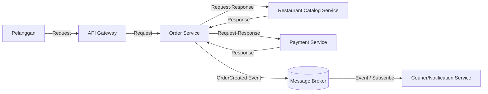

# Tugas 2 — Perancangan Arsitektur FoodGo

**Kelompok:** cloud-bread-foodgo-terdistibusi

| Nama | NIM | Kontribusi |
|---|---|---|
| SALMAN ALFARIZI | 103072400047 | Pemilihan arsitektur, API Gateway, dan diagram |
| MUHAMMAD AUBERT FAWWAZ PRAYITNO | 103072400169 | Komponen service dan komunikasi antar-service |
| BRILIANT DAHSYAT ANUGRAH | 103072400164 | Skenario end-to-end, trade-off, dan kesimpulan |

---

# 1. Pemilihan Gaya Arsitektur

Pada perancangan FoodGo, kelompok kami memilih kombinasi
**Service-Oriented Architecture (SOA)** dan **Publish-Subscribe**.

Kombinasi ini dipilih karena masalah pada Tugas 1 menunjukkan bahwa
FoodGo masih menjalankan beberapa fungsi dalam satu sistem yang sama.
Hal tersebut membuat modul seperti Order, Payment, dan Courier
Notification dapat saling terpengaruh ketika terjadi masalah atau
perubahan pada salah satu bagian.

## 1.1 Service-Oriented Architecture (SOA)

SOA digunakan untuk memisahkan fungsi utama FoodGo menjadi beberapa
service berdasarkan tanggung jawabnya.

Service yang digunakan dalam rancangan ini adalah:

- Order Service
- Payment Service
- Restaurant Catalog Service
- Courier/Notification Service

Dengan pemisahan tersebut, setiap service memiliki tanggung jawab
yang lebih jelas dan tidak semua fungsi harus berada dalam satu aplikasi
monolithic.

Sebagai contoh, proses pembayaran ditangani oleh Payment Service,
sedangkan proses pemesanan ditangani oleh Order Service.

## 1.2 Publish-Subscribe

Publish-Subscribe digunakan untuk komunikasi yang tidak harus
dilakukan secara langsung dan tidak harus menunggu response dari
service lain.

Pada rancangan ini, Order Service dapat menghasilkan event OrderCreated setelah proses pesanan dan pembayaran berhasil.

Event tersebut dikirim ke Message Broker dan kemudian dapat diterima
oleh service yang menjadi subscriber.

Pada rancangan FoodGo, Courier/Notification Service menjadi salah satu
service yang menerima event tersebut untuk melanjutkan proses yang
berhubungan dengan kurir atau notifikasi.

## 1.3 Alasan Menggunakan Kombinasi SOA dan Publish-Subscribe

Kelompok kami memilih kombinasi kedua pendekatan karena tidak semua
komunikasi dalam FoodGo mempunyai kebutuhan yang sama.

Komunikasi yang membutuhkan hasil secara langsung dapat dilakukan
dengan request-response. Contohnya adalah ketika Order Service perlu
berkomunikasi dengan Payment Service.

Sedangkan komunikasi yang tidak harus menunggu response secara langsung
dapat menggunakan event melalui Message Broker.

Dengan cara tersebut, FoodGo tidak harus menggunakan satu jenis
komunikasi untuk seluruh proses.

## 1.4 Keputusan Kelompok

Berdasarkan pertimbangan tersebut, kelompok kami menggunakan:

**SOA untuk memisahkan service utama FoodGo**, dan

**Publish-Subscribe untuk komunikasi berbasis event pada proses yang
tidak harus dilakukan secara langsung.**

Dengan demikian, arsitektur yang digunakan adalah:

> **SOA + Publish-Subscribe**

---

# 2. Komponen dan Interaksi

Rancangan FoodGo menggunakan empat komponen utama sesuai kebutuhan
soal dan dua komponen tambahan yang dianggap relevan, yaitu API
Gateway dan Message Broker.

Komponen yang digunakan adalah:

1. API Gateway
2. Order Service
3. Payment Service
4. Restaurant Catalog Service
5. Courier/Notification Service
6. Message Broker

## 2.1 API Gateway

API Gateway digunakan sebagai pintu masuk request dari pelanggan ke
sistem FoodGo.

Pelanggan tidak perlu mengetahui secara langsung lokasi atau detail
dari setiap service. Request terlebih dahulu masuk melalui API Gateway
dan kemudian diteruskan ke service yang sesuai.

Dalam rancangan ini, API Gateway meneruskan request pemesanan kepada
Order Service.

## 2.2 Order Service

Order Service bertanggung jawab terhadap proses pemesanan pelanggan.

Service ini menerima data pesanan dari pelanggan melalui API Gateway.

Order Service juga menjadi bagian utama dalam alur komunikasi dengan
Payment Service dan Message Broker.

Setelah proses pesanan berhasil, Order Service dapat menghasilkan event
`OrderCreated`.

## 2.3 Payment Service

Payment Service bertanggung jawab untuk menangani proses pembayaran.

Order Service mengirimkan request pembayaran kepada Payment Service.

Payment Service kemudian memberikan response mengenai hasil proses
pembayaran kepada Order Service.

Komunikasi ini menggunakan pola **request-response** atau
**synchronous** karena Order Service membutuhkan hasil pembayaran
untuk melanjutkan proses order.

## 2.4 Restaurant Catalog Service

Restaurant Catalog Service bertanggung jawab terhadap informasi
katalog restoran dan menu yang tersedia.

Ketika pelanggan melakukan pemesanan, Order Service dapat meminta
informasi katalog atau menu yang diperlukan dari service ini.

Komunikasi antara Order Service dan Restaurant Catalog Service dapat
dilakukan secara request-response karena Order Service membutuhkan
informasi menu sebelum membuat pesanan.

## 2.5 Courier/Notification Service

Courier/Notification Service menangani proses yang berhubungan dengan
kurir dan notifikasi.

Service ini menerima informasi order melalui event yang dikirimkan
melalui Message Broker.

Dengan demikian, Order Service tidak perlu melakukan pemanggilan
langsung kepada Courier/Notification Service untuk setiap proses
notifikasi.

## 2.6 Message Broker

Message Broker digunakan sebagai perantara komunikasi berbasis event.

Setelah Order Service menghasilkan event `OrderCreated`, event tersebut
dikirimkan ke Message Broker.

Service yang membutuhkan informasi tersebut dapat menjadi subscriber
dan menerima event melalui broker.

Dalam rancangan ini, Courier/Notification Service menjadi subscriber
untuk event tersebut.

---

# 3. Skenario End-to-End

Skenario yang digunakan adalah proses pelanggan melakukan pemesanan
makanan sampai informasi pesanan diteruskan untuk proses kurir dan
notifikasi.

## 3.1 Pelanggan Mengirim Pesanan

Pelanggan memilih makanan kemudian mengirimkan pesanan melalui aplikasi FoodGo.

Request tersebut masuk terlebih dahulu ke API Gateway.

```text
Pelanggan
    ↓
API Gateway
```

## 3.2 API Gateway Meneruskan Request

API Gateway meneruskan request pelanggan kepada Order Service.

```text
API Gateway
    ↓
Order Service
```

Jenis komunikasi:

**Request**

## 3.3 Order Service Memeriksa Katalog

Order Service membutuhkan informasi menu yang dipilih pelanggan.

Order Service melakukan request kepada Restaurant Catalog Service.

```text
Order Service
    ↓
Restaurant Catalog Service
    ↓
Order Service
```

Jenis komunikasi:

**Synchronous / Request-Response**

Restaurant Catalog Service memberikan response berupa informasi katalog/menu yang diperlukan oleh Order Service.

## 3.4 Order Service Memproses Pembayaran

Setelah informasi pesanan tersedia, Order Service mengirimkan request kepada Payment Service.

```text
Order Service
    ↓
Payment Service
    ↓
Order Service
```

Jenis komunikasi:

**Synchronous / Request-Response**

Payment Service memberikan hasil pembayaran kepada Order Service.

## 3.5 Order Service Membuat Event

Jika pembayaran berhasil dan order dapat dilanjutkan, Order Service menghasilkan event:

```text
OrderCreated
```

Event tersebut dikirimkan ke Message Broker.

```text
Order Service
      ↓
Message Broker
```

Jenis komunikasi:

**Asynchronous / Event**

## 3.6 Message Broker Meneruskan Event

Message Broker menerima event `OrderCreated`.

Courier/Notification Service yang menjadi subscriber menerima event tersebut dari broker.

```text
Message Broker
      ↓
Courier/Notification Service
```

Jenis komunikasi:

**Asynchronous / Event / Subscribe**

Service tersebut kemudian dapat melanjutkan proses yang berkaitan dengan kurir dan mengirimkan notifikasi yang diperlukan.

## 3.7 Alur Keseluruhan

Secara keseluruhan, proses FoodGo dapat digambarkan sebagai berikut:



### Ringkasan Jenis Komunikasi

| Dari | Ke | Jenis Komunikasi |
|---|---|---|
| Pelanggan | API Gateway | Request |
| API Gateway | Order Service | Request |
| Order Service | Restaurant Catalog Service | Synchronous / Request-Response |
| Restaurant Catalog Service | Order Service | Response |
| Order Service | Payment Service | Synchronous / Request-Response |
| Payment Service | Order Service | Response |
| Order Service | Message Broker | Asynchronous / Event |
| Message Broker | Courier/Notification Service | Asynchronous / Event / Subscribe |

---

# 4. Analisis Arsitektur dan Trade-off

## 4.1 Hubungan dengan Masalah pada Tugas 1

Pada Tugas 1, salah satu masalah yang ditemukan adalah FoodGo masih menggunakan satu server untuk menangani beberapa modul sekaligus.

Ketika server mengalami masalah atau terlalu banyak menerima beban, beberapa fungsi dapat ikut terganggu.

Masalah tersebut menunjukkan bahwa FoodGo membutuhkan pemisahan fungsi agar setiap bagian tidak terlalu bergantung pada satu sistem monolithic.

Pada Tugas 2, fungsi tersebut dipisahkan menjadi beberapa service, yaitu Order Service, Payment Service, Restaurant Catalog Service, dan Courier/Notification Service.

## 4.2 Pengaruh SOA terhadap Coupling

Dengan SOA, setiap fungsi utama FoodGo mempunyai service masing-masing.

Order tidak lagi menjadi satu bagian yang menyatu dengan Payment, Restaurant, dan Courier dalam satu aplikasi.

Pemisahan tersebut membuat tanggung jawab setiap service lebih jelas.

Selain itu, jika salah satu service mengalami perubahan, perubahan tersebut tidak selalu harus dilakukan pada seluruh sistem.

Namun, pemisahan service juga menyebabkan komunikasi antar-service menjadi bagian yang harus diperhatikan.

## 4.3 Pengaruh Publish-Subscribe terhadap Coupling

Publish-Subscribe digunakan agar service tertentu tidak harus berkomunikasi langsung dengan semua service yang membutuhkan informasi.

Contohnya adalah ketika Order Service menghasilkan event `OrderCreated`.

Order Service mengirimkan event tersebut ke Message Broker.

Service yang membutuhkan event tersebut dapat menjadi subscriber.

Dengan cara tersebut, Order Service tidak perlu mengetahui secara langsung bagaimana Courier/Notification Service memproses event tersebut.

Hal ini dapat mengurangi ketergantungan langsung antar-service.

## 4.4 Trade-off: Kompleksitas Sistem

Salah satu konsekuensi dari penggunaan beberapa service adalah sistem menjadi lebih kompleks dibandingkan monolithic.

FoodGo sekarang harus mengelola beberapa service dan mekanisme komunikasi di antaranya.

## 4.5 Trade-off: Debugging

Publish-Subscribe juga membuat alur proses tidak selalu berjalan secara langsung.

Pada komunikasi request-response, alurnya relatif mudah ditelusuri:

```text
Order → Payment → Response
```

Sedangkan pada Publish-Subscribe:

```text
Order
  ↓
Message Broker
  ↓
Subscriber
```

Jika terjadi masalah pada event, proses perlu ditelusuri mulai dari publisher, Message Broker, sampai subscriber.

Hal tersebut dapat membuat proses debugging lebih kompleks.

## 4.6 Trade-off: Komunikasi Antar-Service

Setelah service dipisahkan, komunikasi antar-service juga menjadi bagian penting dalam sistem.

Masalah seperti response yang lambat, koneksi gagal, atau event yang belum diproses dapat terjadi.

Karena itu, pemisahan service bukan berarti semua masalah FoodGo langsung selesai.

Sistem tetap membutuhkan monitoring dan pengelolaan komunikasi yang baik.

---

# 5. Kesimpulan

Berdasarkan permasalahan FoodGo pada Tugas 1, kelompok kami memilih menggunakan kombinasi **Service-Oriented Architecture (SOA)** dan **Publish-Subscribe**.

SOA digunakan untuk memisahkan fungsi FoodGo menjadi beberapa service, yaitu Order Service, Payment Service, Restaurant Catalog Service, dan Courier/Notification Service.

API Gateway digunakan sebagai pintu masuk request dari pelanggan, sedangkan Message Broker digunakan sebagai perantara komunikasi berbasis event.

Dalam skenario yang dirancang, komunikasi Order dengan Restaurant Catalog dan Payment menggunakan request-response karena membutuhkan response secara langsung. Setelah order berhasil, Order Service mengirimkan event `OrderCreated` melalui Message Broker yang kemudian diterima oleh Courier/Notification Service secara asynchronous.

Arsitektur ini dapat mengurangi ketergantungan langsung antar bagian FoodGo dibandingkan pendekatan monolithic. Namun, konsekuensinya adalah sistem menjadi lebih kompleks, terutama dalam pengelolaan komunikasi antar-service dan proses debugging event.

Dengan demikian, rancangan ini mencoba menyeimbangkan kebutuhan decoupling FoodGo dengan kompleksitas yang masih dapat dipahami dan dikelola.